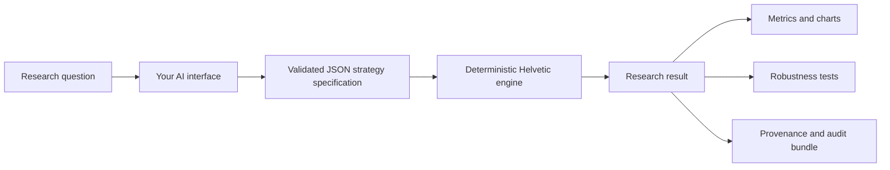

<p align="center">
  <a href="https://helveticresearch.com">
    
  </a>
</p>

<h1 align="center">Helvetic Research</h1>

<p align="center">
  <strong>Institutional research. Conversational speed.</strong><br />
  A research-only quantitative engine for Claude, ChatGPT, Codex, Cursor, and other MCP clients.
</p>

<p align="center">
  <a href="https://helveticresearch.com">Website</a> ·
  <a href="https://helveticresearch.com/sample">Live sample</a> ·
  <a href="https://helveticresearch.com/methodology">Methodology</a> ·
  <a href="https://helveticresearch.com/connect">Connect</a>
</p>

<p align="center">
  
  
  
  
</p>

---

Helvetic Research turns the AI interface you already use into a quantitative research desk.
Describe a strategy, portfolio, signal, or track record; your AI translates the request into a
validated specification and calls a deterministic research engine. The result comes back with
metrics, robustness diagnostics, provenance, integrity checks, and reproducibility metadata.

The hosted service exposes **88 MCP research tools**. It does **not** place trades, connect to
brokers, or provide investment advice.

## Why it exists

Asking an AI to write and run a one-off backtest can produce plausible output without a stable
method, consistent annualisation, realistic costs, or an audit trail. Helvetic separates the two
jobs:



The AI handles conversation and tool selection. Helvetic handles calculation, validation,
storage, provenance, and reporting. Arbitrary client code is never executed inside the hosted
web/MCP process.

## Research → Validate → Understand

| Research | Validate | Understand |
|---|---|---|
| Backtest strategies, portfolios, signals, and external track records | Challenge results for overfitting, instability, costs, look-ahead risk, and regime dependence | Inspect performance drivers, drawdowns, trades, exposures, factors, tail risk, and assumptions |
| Natural language, Pine-like logic, structured JSON, or supplied data | Walk-forward, Monte Carlo, CSCV/PBO, PSR/DSR, stress tests, sensitivity analysis | Interactive result pages, in-chat MCP Apps, PDF/Excel/CSV, and self-verifying audit bundles |

## What you can research

### Strategy inputs

- Plain English or pseudo-code
- Pine-like / TradingView strategy logic
- Deterministic structured JSON
- Strategy IR v3 typed JSON AST
- Client-supplied OHLCV bars, including intraday data
- Client-computed signal or position series
- Multi-asset prices and target weights
- An external return stream or fund track record

### Markets and portfolio work

- Equities, ETFs, indices through suitable tickers or ETF proxies, FX, commodities,
  crypto, futures proxies, and macro/reference series
- Single-instrument rules, long/short research, rotation, multi-asset portfolios,
  synthetic options, universes, and custom supplied books
- CHF, USD, EUR, and GBP reporting currencies
- Monthly, quarterly, semi-annual, annual, and buy-and-hold portfolio rebalancing
- Efficient-frontier, maximum-Sharpe, minimum-volatility, and risk-parity analysis

### Signals and costs

- 40+ indicator families with parameterised periods: moving averages, RSI, MACD,
  Bollinger Bands, ATR, ADX, Ichimoku, Supertrend, volume profile, pivots, Fibonacci,
  Heikin-Ashi, Aroon, Vortex, KST, and more
- Nested AND/OR conditions, crosses, rolling levels, calendar rules, higher-timeframe
  filters, stateful exits, trailing stops, position age, and sizing rules
- Commissions, spreads, slippage, volatility-linked slippage, market impact, short borrow,
  futures roll, crypto funding, FX conversion, management fees, custody fees, and TER

See the full, public [capability catalogue](CAPABILITIES.md).

## Robustness and statistical diagnostics

Helvetic is designed to challenge a result, not merely produce one:

- Walk-forward out-of-sample analysis
- Monte Carlo simulation with IID and block bootstrap
- Parameter sweeps and cost/signal-lag sensitivity
- Probability of Backtest Overfitting via CSCV
- Probabilistic and Deflated Sharpe Ratio
- Historical stress periods and custom scenarios
- Volatility, trend, and macro regime analysis
- Factor exposure, alpha decay, capacity, and implementation-cost analysis
- EVT tail-risk analysis, VaR, and Expected Shortfall
- Trade-order permutation testing to separate a real edge from sequencing luck
- Benchmark-regime Sharpe decomposition showing which regimes the edge actually comes from
- A 12-component Research Grade measuring strength of evidence, not whether a strategy is
  suitable to trade

## Due diligence and record-keeping

Beyond running your own ideas, Helvetic helps you vet others' claims and track what you actually did:

- **Track-record reconciliation** re-simulates a stated set of rules and reconciles the claimed
  return, CAGR, Sharpe, and drawdown against a clean re-run, field by field, flagging any drift
  beyond tolerance. The due-diligence answer to "is this track record real?".
- **Duplicate-strategy detection** fingerprints a strategy by the trades it actually makes and
  flags near-duplicates among your saved runs, so a "new" idea that is really an old bet in a
  different costume is caught even when the rules look different.
- **Research journal** lets you log a trade you actually took with your rationale and a strategy
  tag, close it for an automatic P&L, return, and R-multiple, and review a per-strategy scorecard
  (win rate, expectancy, profit factor). It closes the research-to-reality loop. This is
  record-keeping only: Helvetic executes nothing and gives no advice.

## Outputs and reproducibility

Every completed run records the information needed to understand what was actually tested:

- Data provider and retrieval timestamp
- Adjustment method and coverage information
- Missing-data, stale-cache, and provider-disagreement warnings
- SHA-256 dataset and strategy fingerprints
- Engine version, assumptions, configured costs, and integrity checks
- Frequency-correct performance and risk metrics

Results can be viewed on the interactive web result page or inside supported AI chats through
an MCP App. They can also be exported as branded PDF, Excel, CSV, JSON, or a self-verifying
audit bundle containing raw series, formulas, hashes, assumptions, and provenance.

## Connect an AI client

Helvetic is a hosted, remote MCP server. There is nothing to install: you point your AI client
at one URL and authorise it once with Google.

1. Visit **[helveticresearch.com](https://helveticresearch.com)** and continue with Google.
2. Add the hosted MCP endpoint to your client and complete the OAuth prompt:

   ```text
   https://helveticresearch.com/mcp
   ```

   - **Claude** (Desktop or web): Settings → Connectors → Add custom connector → paste the URL.
   - **ChatGPT** (Developer mode / connectors): add an MCP server with the URL above.
   - **Cursor / Codex / other MCP clients**: add a remote MCP server pointing at the URL.
   - Full, client-specific steps with screenshots: **[/connect](https://helveticresearch.com/connect)**.

3. Send a complete research request. A good first prompt names a ticker, a date range, the rule,
   and the costs:

   ```text
   Backtest SPY from 2005-01-01 to 2026-01-01. Go long when price crosses
   above its 200-day simple moving average and exit when it crosses below.
   Apply 10 bps transaction costs, show the key metrics, then run a
   walk-forward test and an overfitting check.
   ```

More copy-paste starter prompts and ready-to-run strategy specifications are in
**[`examples/`](examples/)**.

The Free plan includes **250 research credits per month** and full available history from
community data sources. Heavy workflows use more credits than lightweight lookups.

## Data coverage

| Asset/data type | Primary path | Fallback/reference path |
|---|---|---|
| Equities and ETFs | Yahoo Finance | Tiingo EOD when configured |
| Crypto | Yahoo Finance | Coinbase Exchange |
| Macro and rates | FRED | ECB Data Portal where applicable |
| FX | Yahoo Finance | ECB reference series where applicable |

Built-in intraday retrieval uses Yahoo/yfinance and preserves full OHLCV timestamps. Practical
provider lookbacks are approximately 7 days for `1m`, 60 days for `2m`–`90m`, and 730 days for
`1h` plus resampled `2h`/`3h`/`4h`. Tiingo and Coinbase fallbacks are daily-only. Longer or
licensed intraday histories can be supplied through custom OHLCV tools.

Community data is useful for research and prototyping but is not a licensed point-in-time
institutional feed. Historical constituents, delistings, symbol changes, corporate actions,
futures rolls, and survivorship controls can be incomplete. Read the full
[data coverage and limitations](DATA_AND_LIMITATIONS.md).

## Important boundaries

- **Research only:** no orders, brokerage connections, or portfolio execution
- **No investment advice:** outputs are analytical and educational
- **Synthetic options:** Black-Scholes simulations, not historical option-chain fills
- **No arbitrary code execution:** strategies run through supported deterministic schemas
- **Private by default:** research records are account-scoped; publication is explicit
- **Failures remain visible:** degraded data and unsupported requests return warnings or clear
  errors rather than silent success

## Public resources

- [Explore a real sample result](https://helveticresearch.com/sample)
- [Read the methodology](https://helveticresearch.com/methodology)
- [Review security controls](https://helveticresearch.com/security)
- [Read the research disclaimer](https://helveticresearch.com/research-disclaimer)
- [Browse the website](https://helveticresearch.com)
- Report vulnerabilities privately using [SECURITY.md](SECURITY.md)

## About this repository

The production research engine is a hosted service and is not open source. This public repository
provides the canonical project overview, capability documentation, data limitations, security
policy, and registry metadata. An open-source verifier for exported Helvetic audit bundles is
planned for this repository.

Questions and product feedback: **[hello@helveticresearch.com](mailto:hello@helveticresearch.com)**

---

<p align="center">
  <a href="https://helveticresearch.com/privacy">Privacy</a> ·
  <a href="https://helveticresearch.com/terms">Terms</a> ·
  <a href="https://helveticresearch.com/legal-notice">Legal notice</a> ·
  <a href="https://helveticresearch.com/research-disclaimer">Research disclaimer</a>
</p>
